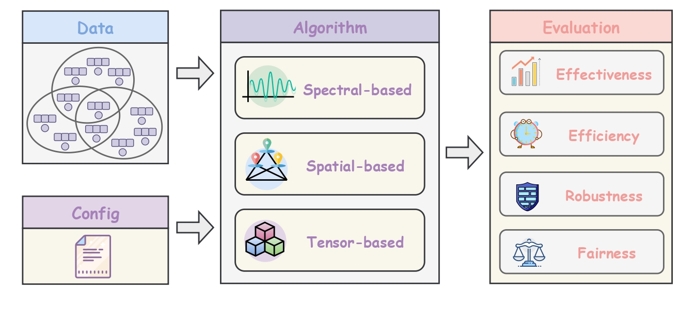

<p align="center">

</p>

<p align="center">
⭐️ If you find <strong>DHG-Bench</strong> useful, please consider giving us a star — your support helps us grow! ⭐️
</p>

------

<p align="center">
  <a href="#overview-of-the-benchmark">Overview of the Benchmark</a> •
  <a href="#installation">Installation</a> •
  <a href="#quick-start">Quick Start</a> •
  <a href="#references">Algorithm References</a> •
  <a href="#citation">Citation</a> 
</p>

# DHG-Bench: A Comprehensive Benchmark for Deep Hypergraph Learning (ICLR 2026)

DHG-Bench is an open and unified pipline for Deep Hypergraph Learning (DHGL) based on [PyTorch](https://pytorch.org/) and [PyTorch Geometric](https://www.pyg.org/). We embark on **17** state-of-the-art hypergraph neural network (HNN) algorithms in node-level, edge-level, and graph-level tasks and analyze their performance in **22** distinct hypergraph datasets.

## <span id="overview-of-the-benchmark">📔 Overview of the Benchmark</span>

<div align="center">
  
  <p align="center"><em>Figure 1: Pipeline of the DHG-Bench.</em></p>
</div>

DHG-Bench provides a fair and comprehensive platform to evaluate existing HNN algorithms and facilitate future DHGL research. Our main contributions are summarized as follows:

* DHG-Bench enables a fair and unified comparison among 17 state-of-the-art HNN algorithms
and 22 diverse hypergraph datasets covering node-level, edge-level, and graph-level tasks. To the
best of our knowledge, this is the first comprehensive benchmark for deep hypergraph learning.

* We conduct a systematic analysis of HNN methods from various dimensions, including effec-
tiveness, efficiency, robustness, and fairness. Through extensive experiments, we reveal both the
strengths and limitations of existing algorithms, offering valuable insights to inform and inspire
future research in this field.

* We release DHG-Bench, an easy-to-use open-source benchmark library to support future DHGL
research. Besides, with our toolkit, users can readily evaluate their algorithms or datasets with
less effort.

## <span id="installation">📦 Installation</span>

Follow the steps below to install and configure **DHG-Bench** properly for your local environment.

**Installation for Local Development:**

``` bash
git clone https://github.com/Coco-Hut/DHG-Bench.git 
cd DHG-Bench
```

**Download Datasets**

All benchmark datasets are available on the Hugging Face Dataset Hub:

https://huggingface.co/datasets/Philley/DHG-Bench-dataset

After downloading `data.zip` from the Hugging Face repository, extract it via:

```bash
unzip data.zip
```
to obtain the data directory. The project structure should look like the following:

```bash
DHG-Bench
  ├── data
  │   ├── fair_data
  │   ├── hete_data
  |   ├── hgcls_data
  │   ├── trad_data
  |   └── ...
  └── dhgbench
  │   ├── main.py
  │   ├── parameter_parser.py
  │   ├── lib_dataset
  │   ├── lib_models
  │   ├── lib_utils
  └── └── ...
```

**Required Dependencies:**

**DHG-Bench** needs the following requirements to be satisfied beforehand:

* Python>=3.9.21
* Pytorch>=2.2.2
* torch_geometric>=2.6.1
* torch-cluster>=1.6.3
* torch-scatter>=2.1.2
* torch-sparse>=0.6.18
* torch-spline-conv>=1.2.2
* deeprobust==0.2.11
* ipdb==0.13.13
* numpy==1.24.3
* dask==2024.8.0

## <span id="quick-start">🚀 Quick Start</span>

The following commands show how to quickly run an existing HNN algorithm across different hypergraph tasks.

For example, to run the HGNN method on the Cora dataset for a node classification task, use the following command:

```bash
python main.py --dname=cora --task_type=node_cls --method=HGNN --is_default=True
```

For example, to run the EDHNN method on the Pubmed dataset for a hyperedge prediction task, use the following command:

```bash
python main.py --dname=pubmed --task_type=edge_pred --method=EDHNN --is_default=True
```

By default, `edge_pred` uses the original DHG-Bench protocol for backward compatibility. To evaluate a held-out hyperedge prediction protocol where validation/test target hyperedges are removed from the message-passing hypergraph, use:

```bash
python main.py --dname=pubmed --task_type=edge_pred --method=EDHNN --is_default=True --edge_pred_protocol=observed
```

In `--edge_pred_protocol=observed`, DHG-Bench builds node embeddings on the observed/support hypergraph only, evaluates separate train/validation/test positive hyperedges, and samples negatives while excluding all true hyperedges. This avoids structural leakage from held-out hyperedges and fixes validation positives to use the validation target set rather than training positives.

For example, to run the TFHNN method on the stream_player dataset for a hypergraph classification task, use the following command:

```bash
python main.py --dname=stream_player --task_type=hg_cls --method=TFHNN --is_default=True
```

Note that The **is_default** parameter indicates whether to use the model’s default configuration. If set to False, the model will instead load parameter settings specific to the given dataset. All model parameter files are provided in the lib_yamls directory.

## <span id="references">🧩 Algorithm References</span>

| **ID** | **Method** | **Paper** |     **Venue**     |  
| :----: | :----: | :----: |:----: |  
|1 | HGNN | [Hypergraph neural networks](https://cdn.aaai.org/ojs/4235/4235-13-7289-1-10-20190705.pdf) | AAAI 2019 | 
|2|HyperGCN|[HyperGCN: A New Method of Training Graph Convolutional Networks on Hypergraphs](https://proceedings.neurips.cc/paper/2019/file/1efa39bcaec6f3900149160693694536-Paper.pdf)|NeurIPS 2019| 
|3| HNHN | [HNHN: Hypergraph Networks with Hyperedge Neurons](https://grlplus.github.io/papers/40.pdf) | ICML WS 2020 | 
|4| HCHA | [Hypergraph convolution and hypergraph attention](https://www.sciencedirect.com/science/article/abs/pii/S0031320320304404?via=ihub) | PR 2020 | 
|5| UniGNN | [UniGNN: a Unified Framework for Graph and Hypergraph Neural Networks](https://www.ijcai.org/proceedings/2021/0353.pdf) | IJCAI 2021 | 
|6| AllSetformer | [You are AllSet: A Multiset Function Framework for Hypergraph Neural Networks](https://openreview.net/forum?id=hpBTIv2uy_E) | ICLR 2022 | 
|7|HyperND|[Nonlinear Feature Diffusion on Hypergraphs](https://proceedings.mlr.press/v162/prokopchik22a/prokopchik22a.pdf)|ICML 2022|
|8| EHNN|[Equivariant hypergraph neural networks](https://arxiv.org/pdf/2208.10428)|ECCV 2022|Y|Y|
|9| LEGCN|[Semi-supervised Hypergraph Node Classification on Hypergraph Line Expansion](https://arxiv.org/pdf/2005.04843)|CIKM 2022|
|10| ED-HNN | [Equivariant Hypergraph Diffusion Neural Operators](https://openreview.net/forum?id=RiTjKoscnNd) | ICLR 2023 | 
|11|PhenomNN|[From Hypergraph Energy Functions to Hypergraph Neural Networks](https://proceedings.mlr.press/v202/wang23d/wang23d.pdf)|ICML 2023|
|12|SheafHyperGNN|[Sheaf Hypergraph Networks](https://proceedings.neurips.cc/paper_files/paper/2023/file/27f243af2887d7f248f518d9b967a882-Paper-Conference.pdf)|NeurIPS 2023|
|13|HJRL|[Hypergraph Joint Representation Learning for Hypervertices and Hyperedges via Cross Expansion](https://openreview.net/forum?id=fxLaL5s6UH)|AAAI 2024|
|14| DPHGNN |[DPHGNN: A Dual Perspective Hypergraph Neural Networks](https://arxiv.org/pdf/2405.16616)|KDD 2024| 
|15|T-HyperGNNs |[T-HyperGNNs: Hypergraph Neural Networks via Tensor Representations](https://ieeexplore.ieee.org/document/10462516)| TNNLS 2024|
|16|HyperGT|[Hypergraph Transformer for Semi-Supervised Classification](https://ieeexplore.ieee.org/stamp/stamp.jsp?tp=&arnumber=10446248)|ICASSP 2024|
|17|TF-HNN |[Training-Free Message Passing for Learning on Hypergraphs](https://openreview.net/pdf?id=4AuyYxt7A2)| ICLR 2025|

## <span id="citation">📖 Citation</span>
The latest version of our paper has be released at: https://openreview.net/forum?id=lhsb1ChUDF

If you use our benchmark in your works, we would appreciate citations to the paper:

```bibtex
@article{li2025dhg,
  title={DHG-Bench: A Comprehensive Benchmark for Deep Hypergraph Learning},
  author={Li, Fan and Wang, Xiaoyang and Zhang, Wenjie and Zhang, Ying and Lin, Xuemin},
  journal={arXiv preprint arXiv:2508.12244},
  year={2025}
}
```
